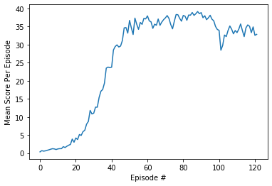
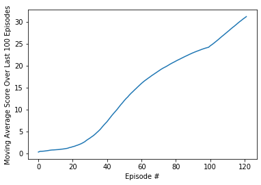

# Project 2: Continuous Control

### Problem Description

In this environment, a double-jointed arm can move to target locations. A reward of +0.1 is provided for each step that the agent's hand is in the goal location. Thus, the goal of your agent is to maintain its position at the target location for as many time steps as possible.

The observation space consists of 33 variables corresponding to position, rotation, velocity, and angular velocities of the arm. Each action is a vector with four numbers, corresponding to torque applicable to two joints. Every entry in the action vector should be a number between -1 and 1.

For this project, we will consider the second version which contains 20 identical agents, each with its own copy of the environment. 

Then, the agents must get an average score of +30 (over 100 consecutive episodes, and over all agents).  Specifically,
- After each episode, we add up the rewards that each agent received (without discounting), to get a score for each agent.  This yields 20 (potentially different) scores.  We then take the average of these 20 scores. 
- This yields an **average score** for each episode (where the average is over all 20 agents).

    - The file `Continuous_Control.ipynb` includes the training of the DDPG agents.
    - The file `ddpg_agent.py` implements the Actor-Critic agents.
    - The file `model.py` implements both Actor-Critic models.
    - The file `trainer.py` implements the DDPG training algorithm.
    - The file `agent_actor.py` contains the weights for the agent network.
    - The file `agent_critic.py` contains the weights for the critic network.

### Algorithm

We considered an amended DDPG (Deep Deterministic Policy Gradients) algorithm given as the 6th point - Benchmark Implementation - Udacity tried in its own implementation.

    - Each agent adds its experience to a replay buffer that is shared by all 20 agents and,
    - the (local) actor and critic networks are updated 10 times after every 20 timesteps,
    - we considered gradient clipping for the critic gradient updates.
    
The implementation is based on the classroom Deep Reinforcement Learning for Optimal Execution of Portfolio Transactions with minor tweaks in the actor-critic model and the amended tweaks in the DDPG algorithm.

For both the Actor and Critic networks we considered a 3 layered neural network with 2 hidden layers. The first layer had 512 units and the second layer had 256 units. Also, after each hidden layer we applied batch normalization so we could regularize better the networks and get better results.

So the architectures were simply: Input Layer -> (512 Units) Hidden Layer -> (256 Units) Hidden Layer -> Output Layer

### Hyperparameters

The hyperparameters shared by all the agents were:
1. The number of episodes,
2. The Buffer size for the replay buffer,
3. Gamma for the iteration update,
5. Tau for the soft copy update,
6. The learning rate for the actor,
7. The learning rate for the critic,
8. The number of timesteps after which we update the target models,
9. The number of learning passes for everytime we update the target models
10. Noise factor and its decay
12. The Batch size

Their values are presented in the header of the `ddpg_agent.py` file, and the values are respectively: 

N_EPISODES = 1800 # maximum number of episodes  
BUFFER_SIZE = int(1e6)  # replay buffer size  
BATCH_SIZE = 256        # minibatch size  
GAMMA = 0.99            # discount factor  
TAU = 1e-3              # for soft update of target parameters  
LR_ACTOR = 1e-3         # learning rate of the actor  
LR_CRITIC = 1e-3        # learning rate of the critic  
WEIGHT_DECAY = 0        # L2 weight decay  
NOISE_FACTOR = 0.999  
NOISE_DECAY = 0.9999  
UPDATE_EVERY = 20       # Update the networks after UPDATE_EVERY timesteps  
N_LEARNING_PASSES = 10  # Number of times we update the network

### Neural Networks Architectures

Both the Actor and Critic networks were 3 layered neural networks with 2 hidden layers. The first layer had 512 units and the second layer had 256 units. Also, after each hidden layer we applied batch normalization so we could regularize better the networks and get better results: Input Layer -> (512 Units) Hidden Layer -> (256 Units) Hidden Layer -> Output Layer

### Rewards plot

In the graphics above you can see the rewards of the trained environment running over consecutive training episodes. Mainly every episode scores above 30.0 after about 100 iterations and it shows that the moving average rewards over all agents are above 31.0 at the 122th episode, which means the environment is solved.

### Solving the environment

The environment was considered solved after 122 episodes (iterations), which means it achieved a moving average score of more than 31.0 over the last 100 episodes after the 122th episode. 

The training algorithm stopped only after having achieved a score higher than 31.0 so it would have a margin above 30.0 to score higher than the requirement to be considered solved.

### Future Ideas To Improve Performance

1. Improve codebase, clean code, redundancies and comments.
2. Organize the code better with more functions and files.
3. Implement other Policy Gradient Methods for Continuous control that might be optimal too.

Other activities that might be helpful:

4. Do a Youtube video showing the agent in action.
5. Work on a Medium article to explain how my project was achieved and what it is doing.
