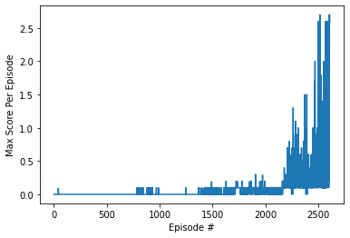
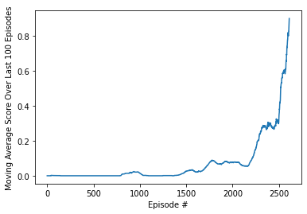

# Project 2: Continuous Control

### Problem Description

In the Tennis environment, two agents control rackets to bounce a ball over a net. If an agent hits the ball over the net, it receives a reward of +0.1.  If an agent lets a ball hit the ground or hits the ball out of bounds, it receives a reward of -0.01.  Thus, the goal of each agent is to keep the ball in play.

The observation space consists of 8 variables corresponding to the position and velocity of the ball and racket. Each agent receives its own, local observation.  Two continuous actions are available, corresponding to movement toward (or away from) the net, and jumping. 

The task is episodic, and in order to solve the environment, the agents must get an average score of +0.5 (over 100 consecutive episodes, after taking the maximum over both agents). Specifically,

- After each episode, we add up the rewards that each agent received (without discounting), to get a score for each agent. This yields 2 (potentially different) scores. We then take the maximum of these 2 scores.
- This yields a single **score** for each episode.

The environment is considered solved, when the average (over 100 episodes) of those **scores** is at least +0.5.

    - The file `Tennis.ipynb` includes the training of the MADDPG agents.
    - The file `maddpg_agents.py` implements a multi agent deep deterministic policy gradient.
    - The file `ddpg_agent.py` implements an Actor-Critic agent.
    - The file `model.py` implements both Actor-Critic models.
    - The file `replay_buffer.py` implements the ReplayBuffer class adjusted for the multi-agent scenario.
    - The file `ounoise.py` implements the class OUNoise.
    - The file `trainer.py` implements the MADDPG training algorithm.
    - The file `agent0_actor.py` contains the weights for the actor network of agent 1.
    - The file `agent0_critic.py` contains the weights for the critic network of agent 1.
    - The file `agent1_actor.py` contains the weights for the actor network of agent 2.
    - The file `agent1_critic.py` contains the weights for the critic network of agent 2.
    
### Algorithm

We considered an amended MADDPG (Multi Agent Deep Deterministic Policy Gradients) algorithm given as

    - Each agent shares a global experience replay buffer among them,
    - the (local) actor and critic networks are updated 10 times after every 10 timesteps.
    
The implementation is based on the classroom Deep Reinforcement Learning  MADDPG lab with minor tweaks in the actor-critic model and the amended tweaks in the MADDPG algorithm being based on the second course project for the DDPG agent coded.

For both the Actor and Critic networks we considered a 3 layered neural network with 2 hidden layers. The first layer had 256 units and the second layer had 128 units.

So the architectures were simply: Input Layer -> (256 Units) Hidden Layer -> (128 Units) Hidden Layer -> Output Layer

### Hyperparameters

The hyperparameters shared by all the agents were:
1. The number of episodes,
2. The Buffer size for the replay buffer,
3. Gamma for the iteration update,
5. Tau for the soft copy update,
6. The learning rate for the actor,
7. The learning rate for the critic,
8. The number of timesteps after which we update the target models,
9. The number of learning passes for everytime we update the target models
10. Noise factor and its decay
12. The Batch size

Their values are presented in the header of the `ddpg_agent.py` and `maddpg_agents.py` files, and the values are respectively: 

N_EPISODES = 5000 # maximum number of episodes  
BUFFER_SIZE = int(1e6)  # replay buffer size  
BATCH_SIZE = 256        # minibatch size  
GAMMA = 0.99            # discount factor  
TAU = 1e-3              # for soft update of target parameters  
LR_ACTOR = 1e-4         # learning rate of the actor  
LR_CRITIC = 1e-3        # learning rate of the critic  
WEIGHT_DECAY = 0        # L2 weight decay  
NOISE_FACTOR = 0.999  
NOISE_DECAY = 0.9999  
UPDATE_EVERY = 10       # Update the networks after UPDATE_EVERY timesteps  
N_LEARNING_PASSES = 10  # Number of times we update the network

### Neural Networks Architectures

Both the Actor and Critic networks were 3 layered neural networks with 2 hidden layers. The first layer had 256 units and the second layer had 128 units: Input Layer -> (256 Units) Hidden Layer -> (128 Units) Hidden Layer -> Output Layer

### Rewards plot

In the graphics above you can see the rewards of the trained environment running over consecutive training episodes. Mainly every episode scores above 0.81 after about 2501 iterations and it shows that the moving average rewards over all agents are above 0.9 at the 2512th episode, which means the environment is solved.

### Solving the environment

The environment was considered solved after 2512 episodes (iterations), which means it achieved a moving average score of more than 0.5 over the last 100 episodes after the 2512th episode. 

The training algorithm stopped only after having achieved an average score higher than 0.9 so it would have a margin above 0.5 to score higher than the requirement to be considered solved.

### Future Ideas To Improve Performance

1. Improve codebase, clean code, redundancies and comments.
2. Organize the code better with more functions and files.
3. Implement a more clean version of the maddpg algorithm.

Other activities that might be helpful:

4. Do a Youtube video showing the agents in action.
5. Work on a Medium article to explain what this project intended to do and the code.
